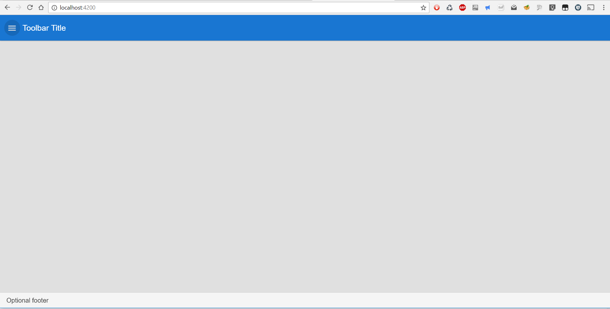

This is really just a seed for a very simple layout like this:




For config optiosn see: https://teradata.github.io/covalent/#/layouts/nav-view

The whole seup can be a bit bitchy, therefore I have also provided a Dockerfile:
```
FROM node

RUN apt-get update
RUN apt-get install git-core -y
RUN mkdir /src 
WORKDIR "/src"
RUN git clone https://github.com/KIC/angular2-material-seed.git
WORKDIR "/src/angular2-material-seed"

RUN npm install -g angular-cli
RUN npm install -g npm-check
RUN npm install

EXPOSE 4200
CMD [ "ng", "serve" , "--host", "0.0.0.0" ]

```

